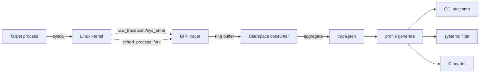

# syscall-profiler

Generate a tight seccomp allowlist profile for any Linux process by observing
the syscalls it actually invokes. Built on libbpf-rs and CO-RE eBPF, so the
tool runs unchanged across kernels with BTF.

## The 30-second pitch

Hand-written seccomp profiles are tedious and almost always either too tight
(your service breaks the first time it hits an uncovered syscall) or too
loose (you copied the Docker default and now `mount` is in your allowlist).
syscall-profiler watches a process during a representative run, records
every syscall it invokes, and emits a minimum-viable profile that you can
drop into a container runtime, systemd unit, or sandbox tool. Because the
profile reflects observed behavior rather than a guess, it tends to be
materially smaller than off-the-shelf defaults.

## Demo

```text
$ sudo syscall-profiler profile run --output curl.json -- curl -s https://example.com
... 1.2 seconds, 47 unique syscalls observed ...
$ syscall-profiler profile generate --input curl.json --format oci > curl-seccomp.json
$ wc -l curl-seccomp.json
   71 curl-seccomp.json
```

A recorded asciinema cast lives in [`docs/demo.cast`](docs/demo.cast)
(placeholder). To regenerate: `./scripts/record-demo.sh`.

## Build prerequisites

- Linux kernel 5.8 or newer (for ring buffer support), with BTF enabled at
  `/sys/kernel/btf/vmlinux`.
- clang 14 or newer (for BPF target with CO-RE relocations).
- libelf and zlib development headers (`libelf-dev`, `zlib1g-dev` on Debian).
- A stable Rust toolchain. The pinned channel in `rust-toolchain.toml` is
  installed automatically by `rustup`.

The minimum supported Rust version (MSRV) is **1.82**. CI exercises the
MSRV on every push.

## Quickstart

```sh
git clone https://github.com/mtclinton/syscall-profiler && cd syscall-profiler
cargo build --release
sudo setcap 'cap_bpf,cap_perfmon=eip' target/release/syscall-profiler
target/release/syscall-profiler profile run -- ls /tmp
```

## Subcommands

| Command | Description |
| --- | --- |
| `profile run -- <command>` | Launch a command and trace it to completion. |
| `profile attach --pid <pid>` | Attach to a running process for a fixed duration. |
| `profile generate --input <trace> --format <fmt>` | Convert a recorded trace to a profile. |
| `profile diff <a> <b>` | Print the symmetric difference of syscall sets. |
| `profile merge <a> <b> [...]` | Union multiple traces into one profile. |

Output formats supported by `profile generate`:

- `json` — internal trace format with counts and timestamps.
- `oci` — `linux.seccomp` block of an OCI runtime spec.
- `systemd` — a `SystemCallFilter=` directive line.
- `seccomp-h` — a libseccomp-friendly C header with `#define`s.
- `markdown` — human-readable report.

## Architecture



The BPF program is small (under 100 lines) and uses only verifier-friendly
constructs: per-CPU ring buffer reservations, bounded array indexing, and
CO-RE relocations against `task_struct` for the fork-following logic.
The userspace consumer is a single thread that polls the ring buffer in a
loop until the target process exits.

See [`docs/architecture.md`](docs/architecture.md) for a deeper walkthrough,
and [`docs/ebpf-design.md`](docs/ebpf-design.md) for verifier notes.

## Comparison

| Tool | Mechanism | Output | Cross-kernel | Notes |
| --- | --- | --- | --- | --- |
| `strace -c` | ptrace | per-syscall counts | yes | High overhead; ptrace conflicts with debuggers; doesn't emit a seccomp profile. |
| `perf trace` | perf events | per-syscall summary | yes | Heavy; output is human-oriented, not machine-consumable. |
| `bpftrace` | scripted eBPF | whatever you scripted | yes (with BTF) | Fantastic for ad-hoc; you write the aggregation yourself. |
| `oci-seccomp-bpf-hook` | runtime hook + eBPF | OCI seccomp | yes | Tied to CRI-O / Podman; not usable for non-containerized workloads. |
| `syscall2seccomp` | parses strace | OCI seccomp | yes | Inherits strace overhead; needs a separate trace step. |
| **syscall-profiler** | libbpf-rs CO-RE eBPF | OCI / systemd / C header / JSON | yes | Single binary, no strace, follows process trees natively. |

Honest tradeoffs: this tool only sees what the workload actually does during
the profiling run. If your test harness doesn't exercise an error path that
calls `prctl`, the generated profile will block `prctl` in production. Treat
generated profiles as a tightening, not a verification.

## Privileges

Loading the BPF program requires `CAP_BPF + CAP_PERFMON` on kernels 5.8+,
or `CAP_SYS_ADMIN` on older kernels. The binary detects which is available
and emits a clear error if neither is granted. The recommended setup for
development is `setcap` rather than running under sudo:

```sh
sudo setcap 'cap_bpf,cap_perfmon=eip' /usr/local/bin/syscall-profiler
```

## Why this exists

I keep ending up in the same situation: I want a tight seccomp profile for
a service, I look at what the runtime gives me by default, and the default
is huge. Hand-paring it down is slow and error-prone, and the next deploy
of the service exercises a syscall I missed. Tools that observe behavior
and emit a profile already exist, but most are tied to a specific runtime
(oci-seccomp-bpf-hook is podman-only) or use ptrace (strace-based tools
are too slow to leave on in CI).

This tool is just the simple intersection: libbpf-rs for the BPF runtime,
clap for the CLI, serde for the trace format, and emitters for whichever
target you're sandboxing. Single static binary, no daemon.

## Roadmap

The following are intentionally out of scope for the initial release:

- Argument capture for `open` / `openat` to also produce path allowlists.
- Network syscall argument capture (socket family/type/protocol).
- Differential profiling: run twice and emit only the delta.
- Containerd NRI plugin or runc hook for transparent containerized profiling.
- TUI mode using `ratatui` for live syscall observation.

## Contributing

See [CONTRIBUTING.md](CONTRIBUTING.md). The CI matrix exercises x86_64 and
aarch64 across Ubuntu 22.04, Ubuntu 24.04, and Fedora 40 on the latest
stable Rust and the MSRV.

## Security

Vulnerability reports go to the maintainer privately; see
[SECURITY.md](SECURITY.md).

## License

Apache-2.0. See [LICENSE](LICENSE).
